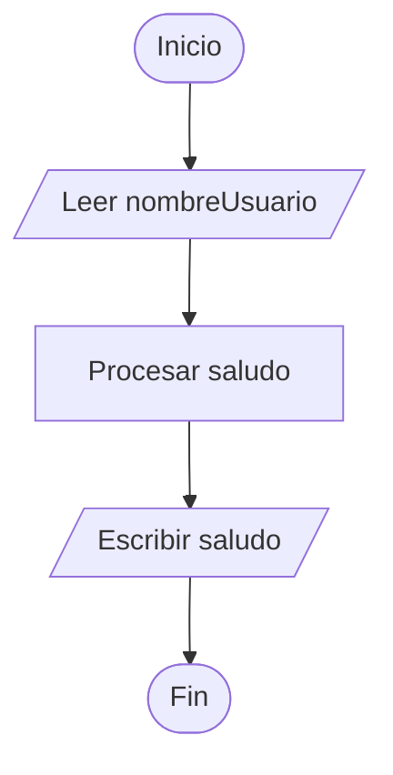

En este primer tema vamos a descubrir qué es exactamente un programa informático y cómo se organiza para que el ordenador sepa qué tiene que hacer. No te preocupes por la complejidad; al final del día, programar es como escribir una receta de cocina muy detallada.

## ¿Qué vamos a aprender?

*   La diferencia entre un **programa** y un **algoritmo**.
*   El modelo **E-P-S** (Entrada, Procesamiento y Salida).
*   Cómo se escribe la estructura básica en **PSeInt**.
*   El concepto de **secuencialidad**.

---

## Concepto Teórico

### ¿Qué es un Algoritmo?
Imagina que quieres explicarle a alguien cómo hacer un café, pero esa persona nunca ha visto una cafetera. Tendrías que darle instrucciones paso a paso, muy precisas y en el orden correcto. Eso es un **algoritmo**: una serie de pasos ordenados y finitos para resolver un problema.

Un **programa informático** no es más que un algoritmo escrito en un lenguaje que el ordenador puede entender.

### Los tres bloques fundamentales: E-P-S
Casi cualquier programa, por complejo que sea, sigue este esquema:

1.  **Entrada (Input)**: El programa recibe datos (desde el teclado, un fichero, un sensor...).
2.  **Procesamiento**: El ordenador realiza cálculos o toma decisiones con esos datos.
3.  **Salida (Output)**: El programa muestra el resultado (por pantalla, impresora, altavoz...).

### Secuencialidad
En programación, el orden de los factores **sí altera el producto**. Las instrucciones se ejecutan de arriba a abajo, una tras otra. Si intentas beber el café antes de poner el agua en la cafetera, algo fallará.

---

## Ejemplo en Código

Vamos a ver nuestro primer programa en pseudocódigo. Su objetivo es muy simple: saludarte por tu nombre.

```javascript title="algoritmos/saludo_personalizado.psc"
Algoritmo SaludoPersonalizado
    // Bloque de Entrada: Pedimos el nombre al usuario
    Escribir "Por favor, dime tu nombre:"
    Leer nombreUsuario
    
    // Bloque de Procesamiento: Creamos el saludo (unión de textos)
    saludo <- "Hola, " + nombreUsuario + ". ¡Bienvenido a Programación!"
    
    // Bloque de Salida: Mostramos el resultado por pantalla
    Escribir saludo
FinAlgoritmo
```

### Explicación paso a paso:
1.  `Algoritmo SaludoPersonalizado`: Indica dónde empieza nuestro programa y le da un nombre.
2.  `Escribir`: Es la instrucción para mostrar mensajes en la pantalla.
3.  `Leer nombreUsuario`: Detiene el programa y espera a que el usuario escriba algo. Lo que escriba se guarda en una "caja" llamada `nombreUsuario`.
4.  `saludo <- ...`: El símbolo `<-` se llama **asignación**. Estamos guardando el resultado de la derecha dentro de la variable de la izquierda.
5.  `FinAlgoritmo`: Indica que el programa ha terminado.

---

## Diagramas

Para visualizar cómo fluye la información, usamos diagramas de flujo. Observa cómo la ejecución es una línea recta de principio a fin:



---

## Errores Comunes

:::warning[¡Cuidado con el orden!]
Uno de los errores más frecuentes al empezar es intentar usar una variable antes de pedir su valor. Por ejemplo:
1. `Escribir "Hola " + nombre`
2. `Leer nombre`

Esto provocará un error porque en el paso 1, el ordenador todavía no sabe qué hay dentro de `nombre`.
:::

---

:::tip[Reto Rápido]
Intenta modificar mentalmente el ejemplo anterior para que el programa, en lugar de saludar, pida dos números y muestre su suma. ¿Qué instrucciones `Leer` y `Escribir` necesitarías?
:::
